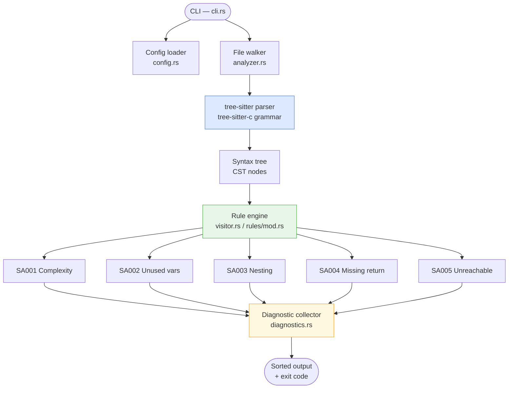

# C Static Analyzer

A lightweight static analyzer for C code that catches common quality, correctness, and maintainability issues before runtime.

It parses `.c`/`.h` files using [tree-sitter](https://tree-sitter.github.io/tree-sitter/) — no compilation or execution of your code required. It reports file-and-line diagnostics with stable rule IDs, exits non-zero on findings, and ships as a single self-contained binary suitable for local use or CI.

---

## Table of Contents

- [Checks](#checks)
- [Quick Start](#quick-start)
- [Usage](#usage)
- [Configuration](#configuration)
- [Architecture](#architecture)
- [Development](#development)
- [Test Results](#test-results)
- [Roadmap](#roadmap)
- [References](#references)
- [License](#license)

---

## Checks

| Rule | Severity | Description |
|------|----------|-------------|
| `SA001` | Warning | Function cyclomatic complexity exceeds threshold |
| `SA002` | Warning | Local variable is assigned but never used |
| `SA003` | Warning | Control flow nesting depth exceeds threshold |
| `SA004` | Error   | Non-void function may not return a value on all paths |
| `SA005` | Warning | Unreachable code after `return`, `break`, `continue`, or `goto` |

---

## Quick Start

```bash
# Build
cargo build --release

# Scan a directory or file
./target/release/c-static-analyzer scan path/to/project
```

### Example

Given this C snippet:

```c
const char *classify(int x) {
    if (x > 0) {
        return "positive";
    } else if (x < 0) {
        return "negative";
    }
}
```

The analyzer reports:

```
example.c:1: [SA004] Function `classify` may not return a value on all code paths
```

---

## Usage

```bash
c-static-analyzer scan [paths ...]
```

**Options**

| Flag | Default | Description |
|------|---------|-------------|
| `--max-complexity N` | `10` | Cyclomatic complexity threshold |
| `--max-nesting N` | `4` | Control flow nesting depth threshold |
| `--select SA001,SA002` | all | Run only the specified rule IDs |
| `--exclude PATTERN` | — | Glob pattern to exclude (repeatable) |
| `--no-config` | — | Ignore `.c-static-analyzer.toml` |

**Exit codes**

| Code | Meaning |
|------|---------|
| `0` | No issues found |
| `1` | One or more diagnostics reported |
| `2` | Usage error (e.g. path does not exist) |

**Sample output**

```
src/app.c:12:  [SA001] Function `parse_request` has cyclomatic complexity 14 (threshold 10)
src/app.c:34:  [SA002] Local variable `unused` is assigned but never used
src/util.c:48: [SA004] Function `convert` may not return a value on all code paths
```

By default the scanner skips common non-project directories: `.git`, `build`, `dist`, `cmake-build-debug`, `cmake-build-release`, `CMakeFiles`, `out`, `vendor`, `third_party`.

---

## Configuration

Create a `.c-static-analyzer.toml` file in (or above) the directory you're scanning. CLI flags take precedence over file settings.

```toml
exclude        = ["tests/fixtures/*"]
max_complexity = 10
max_nesting    = 4
enabled_rules  = ["SA001", "SA002", "SA004"]
```

> `enabled_rules = []` (the default) means all rules are enabled.

---

## Architecture



**Data flow summary**

1. The CLI reads flags and loads `.c-static-analyzer.toml` (unless `--no-config`).
2. The file walker recursively discovers `.c`/`.h` files, applying exclude patterns.
3. Each file is parsed by tree-sitter into a concrete syntax tree (CST) — no compilation needed.
4. Enabled rules walk the CST via `tree_sitter::Node` traversal, emitting `Diagnostic` values.
5. Diagnostics are sorted by file and line, rendered to stdout, and the process exits with the appropriate code.

**Adding a new rule** — create `src/rules/saXXX_name.rs` implementing the rule trait, then register it in `src/rules/mod.rs`. No other files need to change.

---

## Development

**Project layout**

```
c-static-analyzer/
├── Cargo.toml
├── examples/
│   └── sample_issues.c          ← triggers every rule
├── src/
│   ├── main.rs                  ← entry point
│   ├── lib.rs                   ← public API surface
│   ├── cli.rs                   ← argument parsing & orchestration
│   ├── analyzer.rs              ← file discovery & per-file analysis
│   ├── visitor.rs               ← CST traversal helpers
│   ├── config.rs                ← config loading & merging
│   ├── diagnostics.rs           ← Diagnostic type & formatting
│   ├── fnmatch.rs               ← glob/exclude matching
│   └── rules/
│       ├── mod.rs               ← rule registry
│       ├── sa001_complexity.rs
│       ├── sa002_unused_variables.rs
│       ├── sa003_nesting.rs
│       ├── sa004_missing_return.rs
│       └── sa005_unreachable_code.rs
└── tests/
    ├── analyzer.rs
    ├── cli.rs
    └── golden.rs
```

**Common commands**

```bash
cargo build --release                              # production build
cargo test                                         # run all tests
./target/release/c-static-analyzer scan examples/ # smoke test
```

---

## Test Results

44 tests pass: 36 unit tests covering rule logic, config loading, glob matching, and file discovery, plus 8 integration tests covering CLI behaviour and a byte-for-byte golden-output comparison.

```
$ cargo test

running 36 tests ... ok
test result: ok. 36 passed; 0 failed; 0 ignored   (lib / unit tests)

test result: ok.  3 passed; 0 failed; 0 ignored   (tests/analyzer.rs)
test result: ok.  4 passed; 0 failed; 0 ignored   (tests/cli.rs)
test result: ok.  1 passed; 0 failed; 0 ignored   (tests/golden.rs)
```

Running the analyzer on [examples/sample_issues.c](examples/sample_issues.c) (a file written to trigger every rule) confirms end-to-end behaviour:

```
$ c-static-analyzer scan examples/sample_issues.c

examples/sample_issues.c:3:  [SA001] Function `complex_calc` has cyclomatic complexity 12 (threshold 10)
examples/sample_issues.c:18: [SA004] Function `classify` may not return a value on all code paths
examples/sample_issues.c:31: [SA003] Control flow nested 5 levels deep (threshold 4)
examples/sample_issues.c:41: [SA002] Local variable `unused` is assigned but never used
examples/sample_issues.c:45: [SA005] Unreachable code after `return`

5 issue(s) found.
```

---

## References

- [tree-sitter](https://tree-sitter.github.io/tree-sitter/) — incremental parsing library used for CST construction
- [tree-sitter-c](https://github.com/tree-sitter/tree-sitter-c) — C grammar for tree-sitter
- [Cyclomatic Complexity (McCabe, 1976)](https://doi.org/10.1109/TSE.1976.233837) — metric used by SA001
- [MISRA C](https://www.misra.org.uk/) — industry coding standard for C; a reference point for rule design
- [Clang Static Analyzer](https://clang-analyzer.llvm.org/) — production-grade C/C++ analyzer; useful comparison point
- [cppcheck](https://cppcheck.sourceforge.io/) — open-source C/C++ static analysis tool

---

## License

This project is licensed under the terms in [LICENSE](LICENSE).
